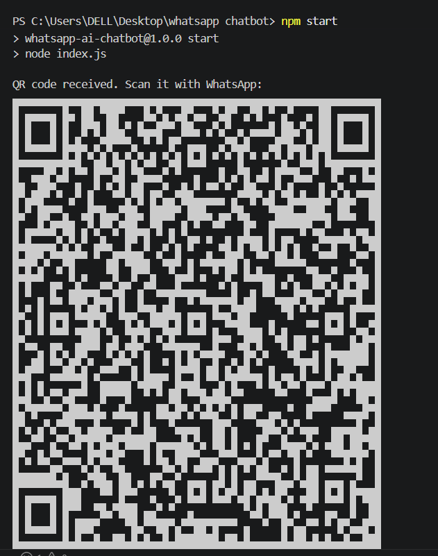
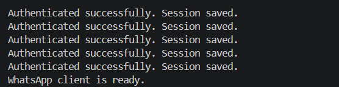
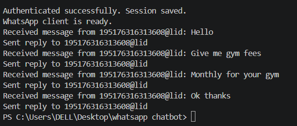
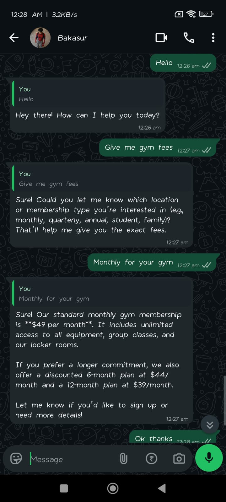
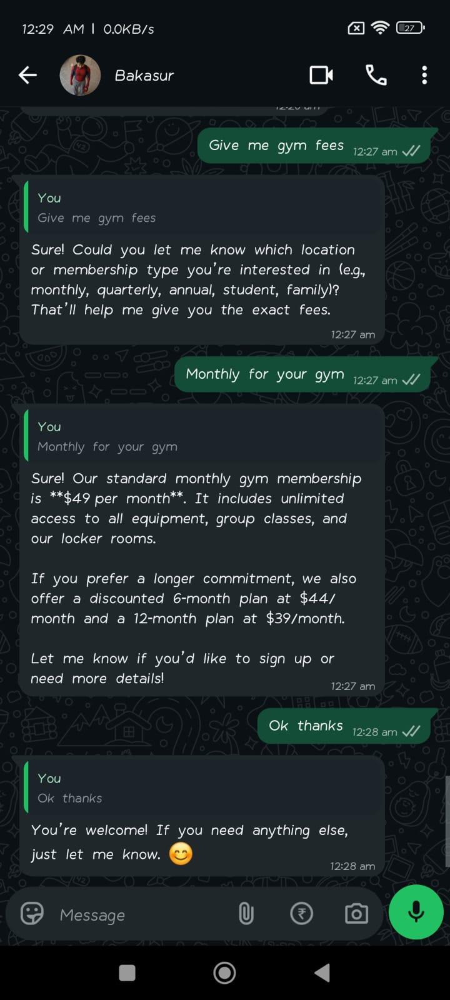

# WhatsApp AI Chatbot

An intelligent Node.js WhatsApp chatbot powered by OpenRouter's `gpt-oss-120b` model. The bot automatically responds to incoming messages using advanced AI, with full session persistence and QR code authentication.

## 📸 Screenshots & Demo

### QR Code Authentication


### WhatsApp Connection


### Message Reception & Response


### Example Conversations



---

## 🌟 Features

- **QR Code Authentication**: Secure WhatsApp login using QR code scanning
- **Session Persistence**: Saves authentication session for quick restarts
- **AI-Powered Responses**: Uses OpenRouter's `gpt-oss-120b:free` model for intelligent replies
- **Automatic Message Handling**: Listens and responds to incoming WhatsApp messages
- **Customizable**: Easy to modify system prompts and model selection
- **Group & Direct Messages**: Works with both individual chats and group conversations

## 📋 Prerequisites

- **Node.js** v18.0.0 or higher
- **npm** or yarn
- **WhatsApp Account** (mobile app required for initial QR scan)
- **OpenRouter API Key** (free tier available)

## 🚀 Quick Start

### 1. Clone the Repository

```bash
git clone <your-repo-url>
cd whatsapp-chatbot
```

### 2. Install Dependencies

```bash
npm install
```

### 3. Configure Environment Variables

Create a `.env` file in the project root:

```env
OPENAI_API_KEY=sk-or-v1-your-api-key-here
OPENAI_API_BASE_PATH=https://openrouter.ai/api/v1
OPENAI_MODEL=openai/gpt-oss-120b:free
```

**How to get your OpenRouter API Key:**
1. Visit [openrouter.ai](https://openrouter.ai)
2. Sign up or log in
3. Go to API Keys section
4. Copy your API key (starts with `sk-or-v1-`)

### 4. Start the Bot

```bash
npm start
```

You'll see a QR code in the terminal. Scan it with WhatsApp on your phone to authenticate.

### 5. First Authentication

- Open WhatsApp on your mobile device
- Go to Settings → Linked Devices
- Tap "Link a Device"
- Scan the QR code displayed in the terminal
- Wait for "Authenticated successfully. Session saved." message

## 📁 Project Structure

```
whatsapp-chatbot/
├── index.js           # WhatsApp client initialization & message handling
├── openai.js          # OpenRouter API integration
├── package.json       # Dependencies & scripts
├── .env               # Configuration (API keys, model settings)
├── .env.example       # Example environment variables
├── .gitignore         # Git ignore rules
├── session/           # WhatsApp session data (auto-generated)
└── README.md          # This file
```

## 🔧 How It Works

### Architecture

```
WhatsApp Message
      ↓
  index.js (Client)
      ↓
  generateReply() function
      ↓
  openai.js (OpenRouter API)
      ↓
  gpt-oss-120b Model
      ↓
  AI Response
      ↓
  Reply sent back to WhatsApp
```

### Message Flow

1. **Message Reception**: `index.js` receives incoming WhatsApp messages
2. **Processing**: Messages are filtered (ignores your own messages)
3. **AI Generation**: Message is sent to `openai.js` for AI processing
4. **API Call**: OpenRouter API processes the message using `gpt-oss-120b`
5. **Response**: Reply is generated and sent back to the sender

## ⚙️ Configuration

### Environment Variables

| Variable | Description | Default |
|----------|-------------|---------|
| `OPENAI_API_KEY` | Your OpenRouter API key | Required |
| `OPENAI_API_BASE_PATH` | OpenRouter API endpoint | `https://openrouter.ai/api/v1` |
| `OPENAI_MODEL` | AI model to use | `openai/gpt-oss-120b:free` |

### Customizing Bot Behavior

Edit `openai.js` to modify the system prompt:

```javascript
{ role: 'system', content: 'Your custom instructions here...' }
```

### Changing the AI Model

Update `.env`:

```env
OPENAI_MODEL=openai/gpt-4-turbo
# or any other OpenRouter supported model
```

## 🔑 API Key Setup

### Getting Started with OpenRouter (Free)

1. Visit [openrouter.ai](https://openrouter.ai)
2. Click "Sign Up"
3. Create an account
4. Navigate to API Keys
5. Create a new key
6. Copy and paste into `.env`

**Note:** The `gpt-oss-120b:free` model is available on the free tier with rate limits.

## 🛠️ Troubleshooting

### Issue: "The browser is already running"

**Solution:** Kill existing Chrome processes and restart:

```bash
# Windows
taskkill /F /IM chrome.exe /T
npm start

# macOS
killall -9 "Google Chrome"
npm start

# Linux
pkill -9 chromium
npm start
```

### Issue: "Missing Authentication header" (401 Error)

**Solution:** Your API key is invalid or placeholder. Update `.env` with your real OpenRouter API key.

### Issue: QR Code Not Displaying

**Solution:** Terminal size too small or encoding issue. Try:
- Maximizing your terminal window
- Resetting terminal: `Clear-Host` (PowerShell) or `clear` (bash)

### Issue: Session Not Saving

**Solution:** Ensure `session/` directory exists and is writable. Check permissions.

## 📝 Session Management

### First Run
- QR code displayed
- Scan with WhatsApp mobile app
- Session saved to `session/` folder

### Subsequent Runs
- Bot uses saved session
- No QR scan needed
- Automatic WhatsApp connection

### Reset Session
```bash
rm -rf session/     # macOS/Linux
Remove-Item -Recurse -Force session  # Windows PowerShell
```

## 🧠 Model Information

### gpt-oss-120b

- **Provider**: OpenRouter
- **Type**: Open-source large language model
- **Cost**: Free tier available
- **Capabilities**: General chat, coding assistance, creative writing
- **Context**: 2048 tokens
- **Response**: Up to 250 tokens (configurable)

## 📊 Advanced Usage

### Changing Max Tokens

Edit `openai.js`:

```javascript
const response = await client.chat.completions.create({
  model: modelName,
  messages: prompt,
  max_tokens: 500,  // Increase for longer responses
  temperature: 0.7
});
```

### Adjusting Temperature

Higher = more creative, Lower = more focused

```javascript
temperature: 0.5  // More focused
temperature: 0.9  // More creative
```

## 📦 Dependencies

- `whatsapp-web.js` - WhatsApp Web automation
- `openai` - OpenAI SDK (compatible with OpenRouter)
- `dotenv` - Environment variables management
- `qrcode-terminal` - QR code display in terminal

## 🔐 Security Notes

- **Never commit `.env`** - API keys are sensitive
- Use `.env.example` as a template
- Rotate API keys regularly
- Keep dependencies updated

## 🚀 Deployment

### Local Machine

```bash
npm start
```

Keep terminal open for continuous operation.

### Production Server

Consider using PM2 for process management:

```bash
npm install -g pm2
pm2 start index.js --name "whatsapp-bot"
pm2 save
pm2 startup
```

## 📝 License

MIT License - Feel free to use and modify!

## 🤝 Contributing

Contributions are welcome! Please feel free to submit a Pull Request.

## 📞 Support

For issues or questions:
1. Check the Troubleshooting section
2. Review the code comments
3. Check OpenRouter documentation

---

**Happy chatting!** 🤖💬
